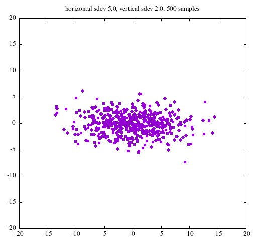

# MTX

mtx is collection of matrix operations not natively supported by gnu APL.
including support for:
<ul>
<li>Matrix determinants</li>
<li>Matrix eigenvalues and eigenvectors</li>
<li>Identity matrices</li>
<li>Vector cross products</li>
<li>Vector interior angles</li>
<li>Vector or scalar rotation matrix</li>
<li>Gaussian complex random values</li>
</ul>

## Installation

See the INSTALL file on how to build mtx, but once it's built and installed
it must be fixed in the workspace:

&nbsp;&nbsp;&nbsp;&nbsp;     'libmtx.so' ⎕fx 'mtx'

using any function name that pleases you instead of 'mtx'.

The general form of the use of mtx is either monadic:

&nbsp;&nbsp;&nbsp;&nbsp;mtx[<em>string</em>] y  

or dyadic:

&nbsp;&nbsp;&nbsp;&nbsp;x mtx[<em>string</em>] y  

where <em>string</em> is one of:
<ul>
<li><em>d</em> -- determinant<li>
<li><em>eigenvalue</em>
<li><em>eigenvector</em>
<li><em>i</em> -- identity<li>
<li><em>c</em> -- cross<li>
<li><em>a</em> -- angle<li>
<li><em>r</em> -- rotation<li>
<li><em>g</em> -- gaussian<li>
<li><em>p</em> -- print<li>
</ul>

(The single-character strings can actually be any string starting with that
letter--spell out, if you like, <em>d</em> as <em>determinant</em>.  All
strings are case-insensitive.)

It's handy to create named lambdas for the mtx opertions.  The ones I use are:
<ul>
<li>det    ← {mtx['d'] ⍵}</li>
<li>eval   ← {mtx['eigenvalue'] ⍵}</li>
<li>evec   ← {mtx['eigenvector'] ⍵}</li>
<li>ident  ← {mtx['i'] ⍵}</li>
<li>cross  ← {⍺ mtx['c'] ⍵}</li>
<li>crossm ← {mtx['c'] ⍵}</li>
<li>angle  ← {⍺ mtx['a'] ⍵}</li>
<li>rotate ← {⍺ mtx['r'] ⍵}</li>
<li>grand  ← {mtx['g'] ⍵}</li>
<li>print  ← {⍺ mtx['p'] ⍵}</li>
</ul>

## Details

### Monadic

#### Determinant

The argument for determinants must be a real or complex square matrix and the
function returns a real result if possible or a complex result if necessary.

#### Eigenvalues, eigenvectors

The argument for these operations must be a real or complex square matrix.  The
eigenvalue function returns a complex vector of the values.  The eigenvector
function returns a complex matrix of the same shape of the argument.

#### Identity

The argument for this operation must be a scalar integer and it returns a
complex square matrix of that dimension with the value 1.0j0.0 on the diagonal
and 0.0j0.0 elsewhere.

#### Rotate

If the argument is a scaler, the function returns a 2 × 2 2D rotation
transformation matrix.  If the argument is a ⍴3 vector, the function returns
a 3 × 3  rotation transformation matrix.

#### Gaussian

Gaussian returns normally distributed (i.e., gaussian) complex random numbers
of mean 0.0j0.0 and a standard deviation of the right argument.  I.e., repeated 
instances of  **mtx['g'] 2.0** would return normally distributed random
numbers.  If the argument is complex, the result will also be complex.  The
result will be of the same shape of the argument, e.g., **mtx['g'] 2 3 4**
will retirn a ⍴ 3 vector of randoms with standard veviations of 2.0, 3.0, and
4.0.  All results are of mean 0.0j0.0 but can be adjusted by addition,
subtraction, or whatever.

### Dyadic

#### Angle

Both arguments must be rank 1 real or complex vectors and must be of the same
length.  The function returns a complex scalar value representing the angle
between the vectors.  (Frankly, I have no idea what it means if the result has
a non-zero imaginary component...)

#### Print

Pretty-prints matrices:

>*matrix* mtx['p'] '*filename*'

### Ambivalent

#### Cross product

In dynadic form, both arguments must be rank 1 real or complex vectors and
must be of length 3.  In monadic form, the argument must be a real or complex
matrix (rank 2) of shape <em>n</em>-1 × <em>n</em> and composed of <em>n</em>-1
real or complex vectors of length  <em>n</em>.

The function returns the real or complex cross product of those
vectors, i.e., a vector of the same length orthogonal to the arguments.
For reasons I'm not enough of a mathematician to understand, cross products
are only valid in 3-space and 7-space, so the only valid arguments are of
shapes [2 3] or [6 7].  mtx, however, doesn't check this and will happily
give you a result in any dimensionality and leave it your imagination what
it may mean.

### Example using normal distribution and matrix printing:

I may add more functionality in later releases.  I'm open to suggestions.

Chris Moller  
henrik@henrikmoller.me
